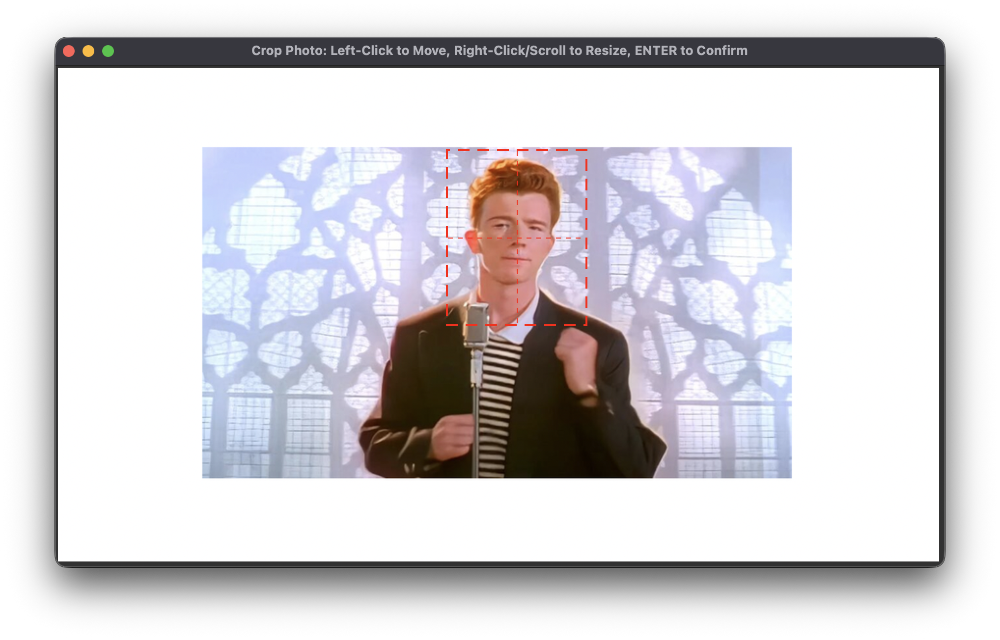
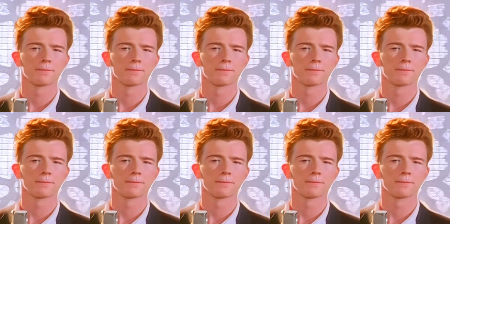

# FourXSix Headshot Generator

## Overview

FourXSix Headshot Generator is a Python application that allows users to arrange headshot photos onto a standard 4x6 canvas for printing. The application provides an interactive cropping tool to ensure that headshots maintain the correct aspect ratio.

Input:


Window for cropping:



Output:



## Usage

To use the FourXSix Headshot Generator, run the following command:

```bash
make install
fshg -i path/to/input/image.png -o path/to/output/image.png
```
